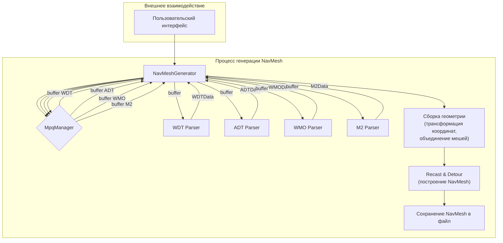

# NavMeshGenerator Architecture

## Оглавление

- [NavMeshGenerator Architecture](#navmeshgenerator-architecture)
  - [Оглавление](#оглавление)
  - [Принцип работы](#принцип-работы)
  - [Компоненты](#компоненты)
    - [1. `NavMeshGenerator` (Оркестратор)](#1-navmeshgenerator-оркестратор)
    - [2. Парсеры (`/core/WoWFiles/Parsers/*`)](#2-парсеры-corewowfilesparsers)
    - [3. `MpqManager`](#3-mpqmanager)
  - [Поток данных (Data Flow)](#поток-данных-data-flow)
  - [Схема архитектуры](#схема-архитектуры)

## Принцип работы

`NavMeshGenerator` является центральным классом-оркестратором для всего процесса создания навигационного меша (NavMesh) из файлов игрового мира World of Warcraft. Его ключевой принцип — **разделение ответственности**.

## Компоненты

### 1. `NavMeshGenerator` (Оркестратор)

- **Роль:** Управляет высокоуровневым процессом генерации.
- **Обязанности:**
  - Определяет, какие карты и тайлы (ADT) необходимо обработать.
  - Через `MpqManager` запрашивает необходимые файлы (`.dbc`, `.wdt`, `.adt`, `.wmo`, `.m2`) из архивов игры.
  - Передает бинарные данные файлов соответствующим парсерам (для форматов `WDT`, `ADT`, `WMO`, `M2`).
  - Получает от парсеров структурированные C++ объекты (`WDTData`, `ADTData` и т.д.).
  - Собирает единую геометрию мира:
    - Извлекает геометрию ландшафта из данных `ADT`.
    - Извлекает геометрию `WMO` (World Map Objects) и `M2` (Doodads).
    - Применяет к `WMO` и `M2` правильные трансформации (позиция, поворот, масштаб) на основе данных о их размещении из `ADT`.
  - Передает финальную собранную геометрию (вершины и полигоны) в библиотеку `Recast & Detour` для построения NavMesh.
  - Сохраняет результат в файл.
- **Чего он НЕ делает:**
  - Не содержит логики парсинга бинарных файлов. Он работает только с готовыми структурами данных.

### 2. Парсеры (`/core/WoWFiles/Parsers/*`)

- **Роль:** Узкоспециализированные инструменты для чтения конкретных форматов файлов.
- **Обязанности:**
  - Принимают на вход бинарный буфер данных файла.
  - Разбирают буфер согласно структуре формата файла.
  - Возвращают C++ структуру, содержащую все необходимые данные из файла.
- **Примеры:**
  - `ADT-парсер`: парсит `.adt` файлы, извлекая геометрию ландшафта (MCVT, MCNR), информацию о размещении объектов (MCRF, MDDF, MODF) и т.д.
  - `WMO-парсер`: парсит `.wmo` файлы, извлекая геометрию крупных объектов (зданий).
  - `M2-парсер`: парсит `.m2` файлы, извлекая геометрию декораций (doodads).

### 3. `MpqManager`

- **Роль:** Низкоуровневый доступ к файлам игры.
- **Обязанности:**
  - Открывает MPQ архивы.
  - Находит и читает запрошенный файл в бинарный буфер.

## Поток данных (Data Flow)

1. **Инициация:** `GUI` или другой управляющий код запускает `NavMeshGenerator`, передавая ему название карты и список координат тайлов (ADTs).
2. **Чтение карты:**
    - `NavMeshGenerator` использует [`MpqManager`](../../../../../../src/core/MpqManager/MpqManager.h) для чтения `Map.dbc` и находит ID и директорию карты.
    - Затем читается главный файл карты `.wdt`, чтобы получить информацию о существующих тайлах (`ADT`).
3. **Обработка тайлов (в цикле по ADT):**
    - `NavMeshGenerator` запрашивает у `MpqManager` очередной `.adt` файл.
    - `ADT-парсер` парсит файл и возвращает `ADTData`. `ADTData` содержит:
        - Геометрию ландшафта, где каждый из 256 чанков (MCNK) уже имеет **готовые мировые координаты своего центра**.
        - Списки используемых `WMO` и `M2` моделей.
        - Информацию о размещении этих моделей, координаты которых требуют **специальной трансформации** для преобразования в мировые.
    - `NavMeshGenerator` обрабатывает эти данные:
        - Добавляет геометрию ландшафта, используя его мировые координаты "как есть".
        - Для каждого `WMO` и `M2`, он запрашивает модель у `MpqManager`.
    - `NavMeshGenerator` добавляет геометрию ландшафта и геометрию всех моделей (с примененными трансформациями) в общий "котел" геометрии мира.
4. **Построение NavMesh:**
    - Когда вся геометрия собрана, она передается в `Recast & Detour`.
    - `Recast & Detour` строит навигационный меш.
5. **Завершение:** Готовый NavMesh сохраняется в файл.

## Схема архитектуры

